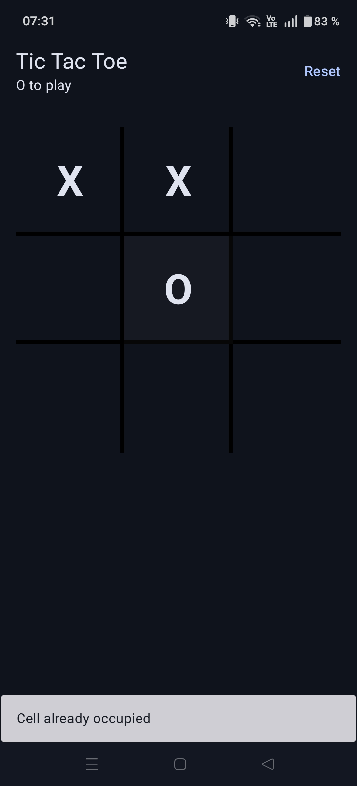

# Tic Tac Toe – Android Code Kata

## Table of Contents

- [Context](#context)
- [Objective](#objective)
- [Application Preview](#application-preview)
- [Tech Stack](#tech-stack)
- [Design](#design)
- [How to Run](#how-to-run)
- [Tests](#tests)
- [Development Approach](#development-approach)
- [Possible Improvements](#possible-improvements)


## Context

This project is an Android code kata developed as part of a technical interview process.
The goal is not to build a complex game or a polished UI, but to demonstrate software craftsmanship,
code quality, and reasoning through a simple and well-known problem.


## Objective

The objective of this kata is to implement a Tic Tac Toe game while focusing on:
- clear domain modeling
- separation of responsibilities
- test-driven development
- readable and maintainable code

The game rules themselves are intentionally simple in order to keep the focus on design and code quality.


## Application Preview




## Tech Stack

- Kotlin
- Jetpack Compose
- Android ViewModel
- JUnit (unit tests)

## Design

The application is structured around a small, explicit domain model.
The game logic is independent from Android and UI concerns, which allows it to be tested in isolation.

The main concepts are:
- a game aggregate responsible for orchestrating state changes
- an immutable board representing the current game state
- a rules evaluator responsible for determining the game status

Note:  
PlantUML diagrams are rendered via the public PlantUML server.  
Due to GitHub caching, diagrams may occasionally appear outdated in the markdown preview.  
The `.puml` source files are the reference and always reflect the latest design.

### Domain Model

The following class diagram illustrates the core domain model and relationships:
- [`Domain Model`](docs/domain-model.md)

### Main Interaction Flow

The following sequence diagram shows the main interaction flow when a player makes a move:
- [`Sequence Play Move`](docs/sequence-play-move.md)


## How to Run

### Using Android Studio / IntelliJ

1. Open the project in Android Studio (or IntelliJ with Android support)
2. Sync Gradle
3. Run the `Run app` configuration on an emulator or a physical device

Shared run configurations are provided with the project for convenience.

### Using Gradle (command line)

From the project root:
```bash
./gradlew installDebug
```
> An emulator or physical device must be running.


## Tests

The project contains two types of tests:
> All Gradle commands below are expected to be run from the project root.

### Unit tests (JVM)

These tests cover:
- the domain game logic
- the ViewModel and UI state

Run with:
```bash
./gradlew testDebugUnitTest
```

### Instrumented tests (Compose UI)

These tests cover:
- UI interactions
- user flows
- error handling

Run with:
```bash
./gradlew connectedDebugAndroidTest
```
> An emulator or physical device must be running.

### Running all tests

Both unit and instrumented tests can be run together with:
```bash
./gradlew testDebugUnitTest connectedDebugAndroidTest
```
> An emulator or physical device must be running.

### Using the IDE

Shared run configurations are provided with the project:
- `Run app`
- `Unit tests (JVM)`
- `Android tests (instrumented)`

These configurations can be used directly from Android Studio or IntelliJ to run the application or the different test suites.


## Development Approach

This repository history reflects the incremental steps taken during development.
Each change was committed with the intent to keep the evolution of the solution readable,
rather than squashing commits into a single final state.


## Possible Improvements

The following ideas were intentionally left out of the kata scope, but could be explored further:
- Persist the current game state locally (e.g. to survive process death)
- Add game history and move replay
- Support named players instead of fixed X / O
- Store and display game statistics or a leaderboard
- Allow configurable board sizes
- Add an optional AI opponent

